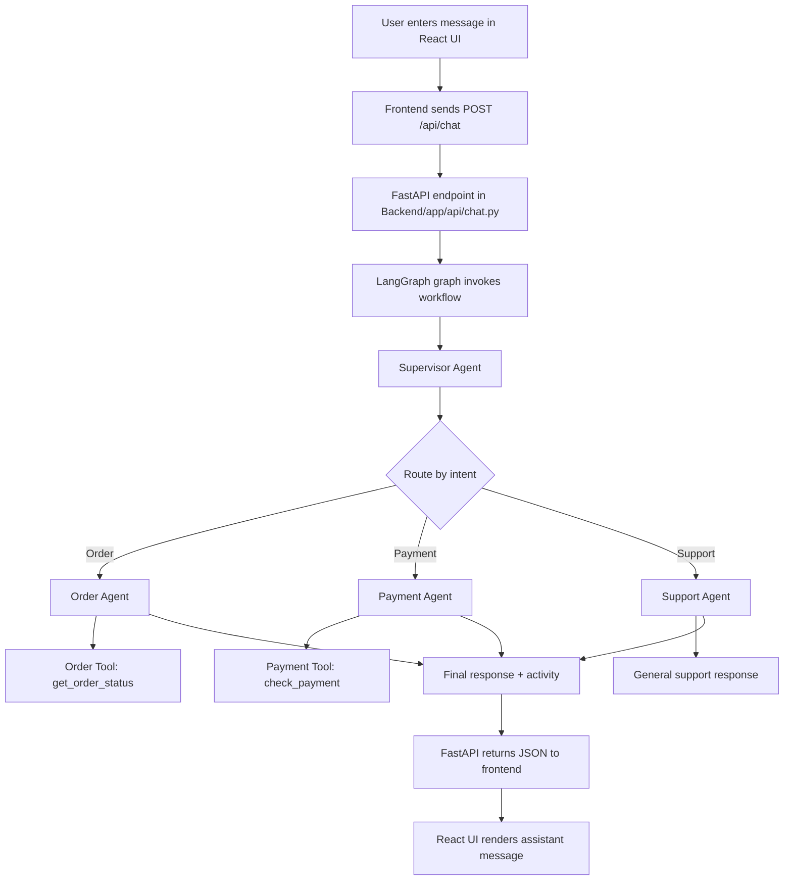

# Full Stack Chatbot

This project is a multi-agent customer support chatbot built with a React frontend and a FastAPI + LangGraph backend. It routes user requests to specialized AI agents for orders, payments, and general support.

## Overview

The system is designed to simulate a modern AI customer support desk:

- A user sends a message from the frontend.
- The backend API receives the request.
- A LangGraph state machine decides which specialist agent should handle it.
- The selected agent uses an LLM and domain-specific tools to generate a concise answer.
- The final response and activity trail are returned to the UI.

## Tech Stack

- Frontend: React + Vite
- Backend: FastAPI
- Agent orchestration: LangGraph
- LLM integration: LangChain + OpenAI
- Demo business tools: order lookup and payment validation

## Project Structure

```text
Full stack chatbot/
├── Backend/
│   ├── app/
│   │   ├── agents/
│   │   │   ├── order_agent.py
│   │   │   ├── payment_agent.py
│   │   │   ├── supervisor.py
│   │   │   └── support_agent.py
│   │   ├── api/
│   │   │   └── chat.py
│   │   ├── graph/
│   │   │   ├── state.py
│   │   │   └── workflow.py
│   │   ├── tools/
│   │   │   ├── order_tools.py
│   │   │   └── payment_tools.py
│   │   ├── __init__.py
│   │   └── main.py
│   ├── requirement.txt
│   ├── README.md
│   └── start_backend.ps1
├── Frontend/
│   ├── src/
│   ├── index.html
│   ├── package.json
│   └── vite.config.js
├── README.md
└── .gitignore
```

## Architecture Flow



## Agent Behavior

### 1. Supervisor Agent
The supervisor decides which specialized agent should answer the customer request.

Supported routes:

- ORDER
- PAYMENT
- SUPPORT

This decision is executed in the supervisor node and stored in the graph state as `next_agent`.

### 2. Order Agent
Handles:

- order status
- shipping updates
- delivery questions
- order number lookup

It uses the `get_order_status` tool to query demo order data.

### 3. Payment Agent
Handles:

- duplicate charges
- refund requests
- payment status issues

It uses the `check_payment` tool to inspect the message for demo payment issues.

### 4. Support Agent
Handles:

- general support questions
- company policies
- FAQs
- product information

It provides a safe fallback for general queries when specific data is not required.

## Backend Workflow

The main graph is defined in [Backend/app/graph/workflow.py](Backend/app/graph/workflow.py).

Key flow:

1. `START` enters the `supervisor` node.
2. The supervisor chooses the next agent.
3. The selected agent runs and produces a final response.
4. The graph terminates at `END`.

State is defined in [Backend/app/graph/state.py](Backend/app/graph/state.py), which contains:

- `messages`
- `next_agent`
- `final_response`
- `last_agent`
- `activity`

## API Endpoint

The FastAPI backend exposes a chat route at:

- `POST /api/chat`

Request body:

```json
{
  "message": "Where is my order 12345?",
  "conversation_id": "demo-conversation"
}
```

Response:

```json
{
  "conversation_id": "demo-conversation",
  "response": "Your order 12345 is shipped...",
  "agent": "order_agent",
  "activity": ["Supervisor → Order Agent", "Order Agent → get_order_status(12345)"]
}
```

## Frontend

The frontend is a single-page React app under [Frontend/src](Frontend/src). It:

- collects the user message,
- sends it to the backend API,
- displays conversation history,
- shows assistant responses and activity metadata.

The main API client is in [Frontend/src/api/chatApi.js](Frontend/src/api/chatApi.js).

## Setup Instructions

### 1. Backend setup

From the project root or the Backend folder:

```powershell
cd "d:\Full stack chatbot\Backend"
python -m venv .venv
.\.venv\Scripts\python -m pip install -r requirement.txt
```

Add your OpenAI API key before starting the backend:

```powershell
$env:OPENAI_API_KEY = "your_api_key_here"
.\.venv\Scripts\python -m uvicorn app.main:app --reload --host 127.0.0.1 --port 8000
```

You can also use the helper script:

```powershell
cd "d:\Full stack chatbot\Backend"
powershell -NoProfile -ExecutionPolicy Bypass -File .\start_backend.ps1
```

### 2. Frontend setup

```bash
cd "d:\Full stack chatbot\Frontend"
npm install
npm run dev
```

Then open the local Vite URL in the browser, usually:

- http://localhost:5173

## Environment Variables

Set the following in your environment:

```powershell
$env:OPENAI_API_KEY = "your_key"
```

## Features

- AI-powered request routing
- Multi-agent specialization
- FastAPI backend API
- React chatbot UI
- Demo customer support tools
- Activity tracking per agent

## Notes

This project uses demo-order and demo-payment logic rather than a real database or production payment system. It is intended as a learning project and a foundation for more advanced support workflows.

## Typical User Flow

1. User asks: "Where is my order 12345?"
2. Supervisor routes to Order Agent.
3. Order Agent extracts `12345`.
4. Tool returns the order status.
5. LLM formats the final answer.
6. Response appears in the chat UI.

## License

This project is provided as a sample application for demonstration and educational purposes.
